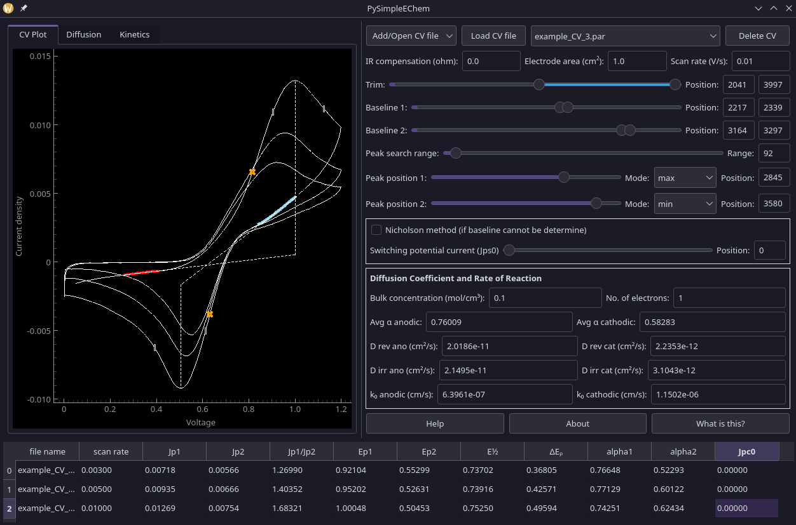
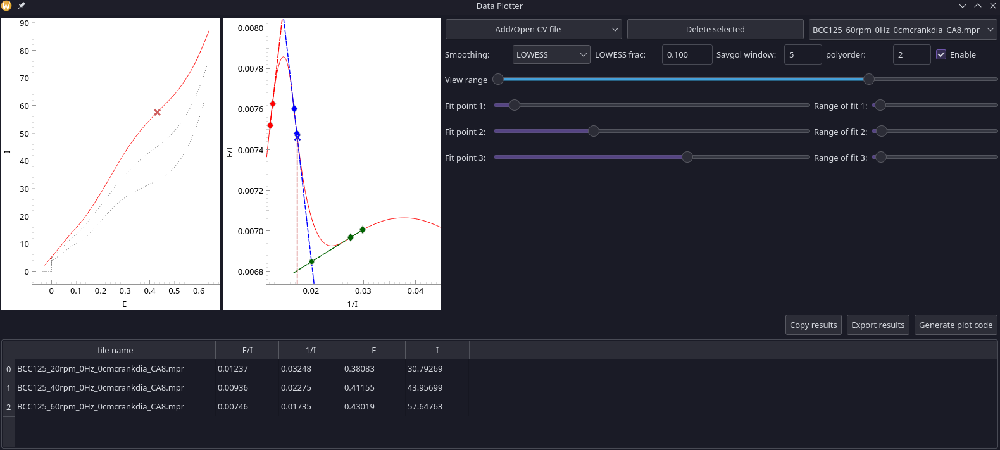
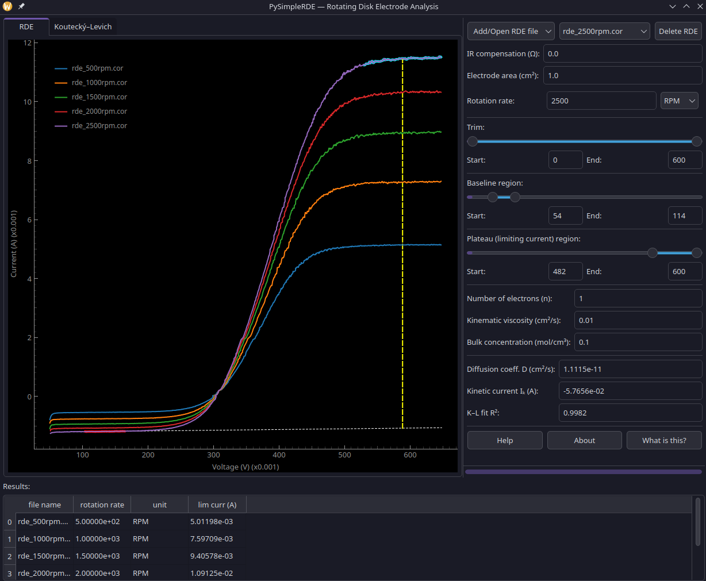

# PySimpleEChem

Graphical user interface for plotting and analysing voltammograms with simple-to-use sliders.<br />
Written in pure Python.<br />

PySimpleEChem is written in PyQt5 to replace PySimpleCV, which used PySimpleGUI before it switched to a proprietary license.<br />
License: GPLv3

---

## Screenshots

### Cyclic Voltammetry (PySimpleEChem)


### Limiting Current (PyLimitingCurrent)


### Rotating Disk Electrode (PySimpleRDE)


---

## Features

PySimpleEChem is in pre-alpha and is not ready for everyday usage.<br />
Feel free to open a bug report or feature request.

**Cyclic voltammetry (PySimpleEChem.py)**
* Select and plot multiple CVs at the same time.
* Supports VersaStudio (.par), CorrWare (.cor), .csv, and .txt. For .csv and .txt, the first column must be voltage and the second column must be current.
* Baseline subtraction with adjustable range sliders.
* Peak detection via maximum, minimum, or 2nd derivative method.
* Nicholson method for peak current when the baseline cannot be determined.
* Alpha (charge-transfer coefficient) calculation.
* Diffusion coefficient from the Randles–Ševčík equation.
* Standard rate constant from Butler–Volmer kinetics.
* IR compensation and electrode area normalisation.
* Export results to CSV.

**Rotating Disk Electrode (PySimpleRDE.py)**
* Select and plot LSVs recorded at multiple rotation rates.
* Supports VersaStudio (.par), CorrWare (.cor), .csv, and .txt.
* Adjustable baseline and plateau region sliders for reproducible limiting-current determination.
* Koutecký–Levich analysis to separate diffusion-limited and kinetic currents.
* Diffusion coefficient and kinetic current calculation.
* IR compensation and electrode area normalisation.
* Export results to CSV.

---

## PyLimitingCurrent.py

Graphical user interface for measuring the limiting current from a linear sweep voltammogram (LSV) with simple-to-use sliders. The limiting current is used to determine the mass transport coefficient.

The method plots the LSV as 1/I (x-axis) vs. E/I (y-axis) to make the limiting current determination more reproducible.

See: Ponce-de-León, C., Low, C.T.J., Kear, G. et al. *Strategies for the determination of the convective-diffusion limiting current from steady state linear sweep voltammetry.* J Appl Electrochem **37**, 1261–1270 (2007). https://doi.org/10.1007/s10800-007-9392-3

---

## PySimpleRDE.py

Graphical user interface for analysing rotating disk electrode (RDE) linear sweep voltammograms with simple-to-use sliders.

LSVs recorded at different rotation rates are loaded and plotted together. Adjustable sliders define the baseline region and the plateau (limiting-current) region for each curve. The tool applies the Koutecký–Levich equation to separate the diffusion-limited current from the kinetic current, and returns the diffusion coefficient and kinetic current density directly.

See: 
Pine Research Instrumentation, Inc.. youtube.com/@Pineresearch. *How to determine the mass transport limiting current in RDE*. https://www.youtube.com/watch?v=KVtw_9vL0fo

See: Bard, A.J. & Faulkner, L.R. *Electrochemical Methods: Fundamentals and Applications*, 2nd ed., Wiley (2001), Chapter 9.

---

## Installation

### Dependencies

Both `PySimpleEChem.py`,`PyLimitingCurrent.py`, and `PySimpleRDE.py` require:

| Package | Purpose |
|---------|---------|
| `numpy` | Numerical arrays and maths |
| `pandas` | Data handling |
| `matplotlib` | Plotting (some views) |
| `pyqtgraph` | Fast interactive plots |
| `PyQt5` | GUI framework |
| `superqt` | Range slider widget |
| `statsmodels` | LOWESS smoothing for peak detection |
| `scipy` | Signal filtering |
| `galvani` | Reading Bio-Logic (.mpr) files |

---

### Linux

#### 1. Install Python

Most Linux distributions ship Python 3 by default. Check your version:

```bash
python3 --version
```

If Python 3.8 or newer is not installed, install it via your package manager:

```bash
# Debian / Ubuntu
sudo apt update && sudo apt install python3 python3-pip python3-venv

# Fedora
sudo dnf install python3 python3-pip

# Arch
sudo pacman -S python python-pip
```

#### 2. Create and activate a virtual environment (recommended)

```bash
cd /path/to/PySimpleEChem
python3 -m venv venv
source venv/bin/activate
```

#### 3. Install dependencies

```bash
python3 -mpip install numpy pandas matplotlib pyqtgraph PyQt5 superqt statsmodels scipy galvani
```


#### 4. Run

```bash
# Cyclic voltammetry tool
python3 PySimpleEChem.py

# Limiting current tool
python3 PyLimitingCurrent.py

# Rotating disk electrode tool
python3 PySimpleRDE.py
```

---

### Windows

#### 1. Install Python

Download the latest Python 3 installer from https://www.python.org/downloads/windows/ and run it.

**Important:** tick **"Add Python to PATH"** on the first installer screen before clicking Install Now.

Verify the installation by opening Command Prompt (`Win + R` → `cmd`):

```cmd
python --version
```

#### 2. Create and activate a virtual environment (recommended)

Open Command Prompt and navigate to the project folder:

```cmd
cd C:\path\to\PySimpleEChem
python -m venv venv
venv\Scripts\activate
```

If you see a script execution policy error in PowerShell, run:

```powershell
Set-ExecutionPolicy -ExecutionPolicy RemoteSigned -Scope CurrentUser
```

then activate again:

```powershell
venv\Scripts\Activate.ps1
```

#### 3. Install dependencies

```cmd
pip install numpy pandas matplotlib pyqtgraph PyQt5 superqt statsmodels scipy galvani
```

#### 4. Run

```cmd
python PySimpleEChem.py
python PyLimitingCurrent.py
python PySimpleRDE.py
```

---

### Using conda (Linux or Windows)

If you prefer Anaconda or Miniconda:

```bash
conda create -n pyechem python=3.11
conda activate pyechem
pip install numpy pandas matplotlib pyqtgraph PyQt5 superqt statsmodels scipy galvani
```

Then run as above with the environment activated.

---

## Future plans

* Better file format support — please share sample files for formats not yet supported.
